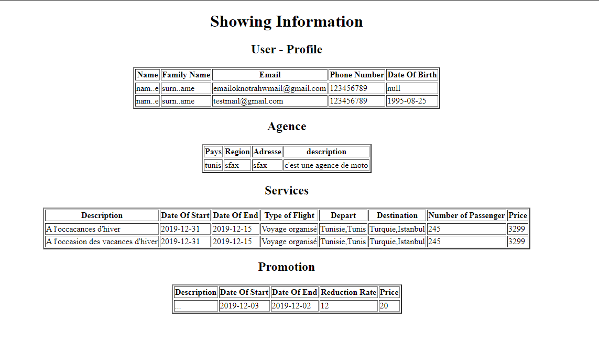

# microservices
Travel Agency Microservices

# Description
In this repository you will find our devided services composing the parts of our project base on spring boot framework, jpa, mysql and hibernate.

# Travel Agency Project
## Use Case Diagrammes: 
### User Management:

### Post Management:

### Service Management:

### Commands Management:

### Commands Management:


## Class Diagrammes: 


## Configuration :
### STEP 1 : Clone the project :
```console
git clone https://github.com/iradbouzidi/microservices.git
```
### STEP 2 :
Do ` mvn update` for all projects 
### STEP 3 :
Open all projects and run them on different server ports
### STEP 4 :
Run Eureka discovery server on 8761
### STEP 5 :
Run Zuul project


## Testing CRUD with Postman:
# Adding User


# Getting Agency


# Updating Service


# Deleting Service

